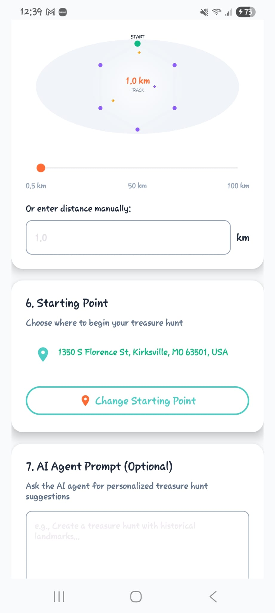
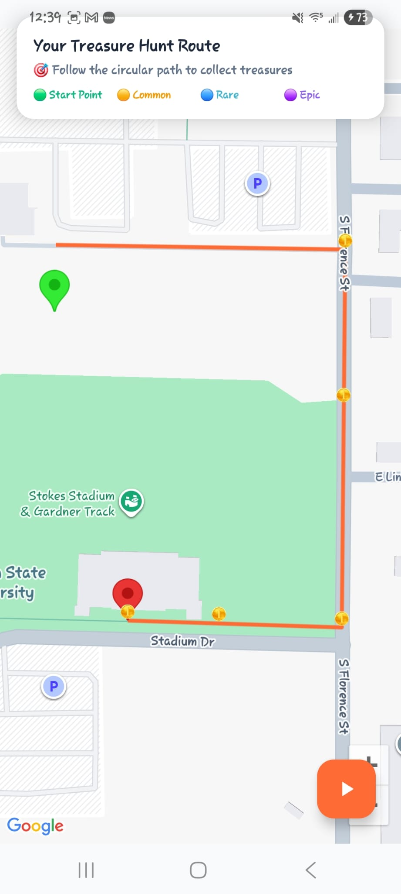
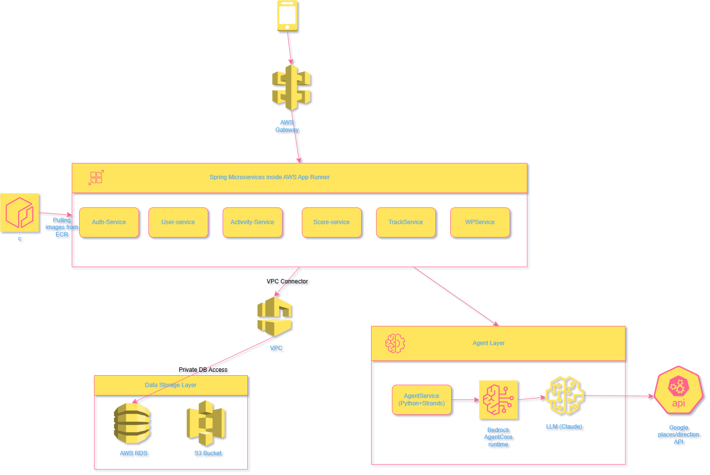

<h1 align="center"> CalorieChase </h1>
<p align="center">
  
</p>
An AI-powered fitness gamification app that transforms outdoor workouts into exciting treasure hunt adventures.
<div align="center">

[](https://developer.android.com)
[](https://spring.io/projects/spring-boot)
[](https://openjdk.org/)
[](https://aws.amazon.com/bedrock/)
[](https://aws.amazon.com/bedrock/agents/)
[](https://aws.amazon.com/)


</div>

## Table of Contents

- [Overview](#overview)
- [Features](#features)
- [Architecture Overview](#architecture)
- [Quick Start](#installation-guide)
- [Tech Stack](#tech-stack)
- [License](#license)
- [Contributing](#contributing)
- [acknowledgements](#acknowledgments)
- [Contact](#contact-author-info)


## Overview

CalorieChase is an innovative Android fitness application that combines real-world location tracking with gamified treasure hunting mechanics. Users set fitness goals, and the app generates personalized routes with virtual treasures to collect, making exercise engaging and rewarding. The app leverages AI agents and Google Places API to create intelligent, context-aware workout routes based on user preferences.

Built with modern Android development practices, CalorieChase integrates Google Maps, step counting sensors, geofencing, and AI-powered location discovery to deliver a seamless fitness experience.

---

## Features

### Create your custom track mentioning distance, mode (walk/jog/run), prompt [AI agent will find the best fitting track for you]
<p align="center">
  
</p>

### Collect treasures on your own made track just like the game **Pokemon Go**
<p align="center">
  
</p>

### After you finish the game, get a detailed score.
<p align="center">
  
</p>

### Get daily and weekly info on the dashboard with graphs, charts, and other visual cues.
<p align="center">
  
</p>


---

## Tech Stack

### Android Development
- **Language**: Java
- **Min SDK**: 24 (Android 7.0)
- **Target SDK**: 36 (Android 14+)
- **Build System**: Gradle with Kotlin DSL

### Core Libraries
- **AndroidX**: Navigation, AppCompat, Material Design 3
- **Google Play Services**: Maps, Location, Places API
- **Retrofit**: REST API client for Google Places integration
- **Gson**: JSON serialization/deserialization

### Sensors & Services
- **FusedLocationProviderClient**: High-accuracy GPS tracking
- **GeofencingClient**: Automatic treasure collection
- **Step Counter Sensors**: TYPE_STEP_COUNTER, TYPE_STEP_DETECTOR
- **Foreground Service**: Background location tracking during sessions

### AI & Backend
- **Strands SDK**: AI agent framework for intelligent location discovery
- **Google Places API**: Nearby search and place details
- **FastAPI**: Python backend server for agent endpoints
- **Bedrock AgentCore**:
-  

### Data Persistence
- **AWS RDS**: The main database that was integrated with backend microservices
- **SharedPreferences**: User profile and session state
- **Room Database**: Session history and analytics (ready for implementation)

---

## File Structure

```
CalorieChase/
├── app/
│   ├── src/
│   │   ├── main/
│   │   │   ├── java/com/example/caloriechase/
│   │   │   │   ├── api/                    # API interfaces and models
│   │   │   │   │   ├── ApiService.java
│   │   │   │   │   ├── DirectionsResponse.java
│   │   │   │   │   ├── GooglePlacesResponse.java
│   │   │   │   │   └── RetrofitClient.java
│   │   │   │   ├── data/                   # Data models and database
│   │   │   │   ├── error/                  # Error handling utilities
│   │   │   │   ├── location/               # Location services
│   │   │   │   ├── utils/                  # Helper utilities
│   │   │   │   ├── views/                  # Custom views
│   │   │   │   │   └── TrackVisualizationView.java
│   │   │   │   ├── MainActivity.java       # Main container with tabs
│   │   │   │   ├── HomeFragment.java       # Map and session setup
│   │   │   │   ├── DashboardFragment.java  # Fitness tracking dashboard
│   │   │   │   ├── SessionSetupActivity.java    # Session configuration
│   │   │   │   ├── SessionMapActivity.java      # Route preview
│   │   │   │   ├── GameplayActivity.java        # Active gameplay
│   │   │   │   ├── SessionSummaryActivity.java  # Workout summary
│   │   │   │   ├── GeofenceReceiver.java        # Treasure collection
│   │   │   │   ├── TrackingService.java         # Background tracking
│   │   │   │   ├── FitnessTracker.java          # Calorie calculations
│   │   │   │   ├── UserDataManager.java         # User profile management
│   │   │   │   └── OnboardingActivity.java      # First-time setup
│   │   │   ├── res/
│   │   │   │   ├── layout/             # XML layouts
│   │   │   │   ├── values/             # Colors, strings, themes
│   │   │   │   └── drawable/           # Icons and graphics
│   │   │   └── AndroidManifest.xml
│   │   └── build.gradle.kts
│   └── build.gradle.kts
├── LocoAgent/                          # AI Agent implementation
│   ├── tools/                          # Agent tool implementations
│   │   ├── __init__.py
│   │   ├── estimate_calories.py        # Calorie estimation tool
│   │   └── plan_route.py               # Route planning tool
│   ├── config/                         # Agent configuration files
│   │   ├── __init__.py
│   │   └── config.py                   # Configuration settings
│   ├── agent.py                        # Agent core logic and tools
│   ├── server.py                       # FastAPI server endpoints
│   ├── main.py                         # Agent testing and execution
│   ├── .env                            # Environment variables and API keys
│   └── README.md                       # Agent documentation
├── Server/                             # Spring Boot microservices
│   ├── UserService/                    # User profile management
│   ├── ActivityService/                # Session and activity logging
│   ├── ScoreService/                   # Performance scoring system
│   ├── TrackService/                   # Route generation and tracking
│   └── WPService/                      # Waypoint management
├── docs/                               # Project documentation
├── build.gradle.kts
├── settings.gradle.kts
└── README.md
```

## Architecture
<p align="left">
  
</p>

## 🏗️ Architecture Overview  

CalorieChase is built on a **multi-layered microservice architecture** deployed on **AWS App Runner**, ensuring scalability, modularity, and secure data flow across all layers.  

### **1. Frontend Layer**  
- Android app that interacts with backend microservices through REST APIs.  
- Displays live tracking, session analytics, and calorie metrics.  

### **2. API Gateway**  
- Managed via **AWS API Gateway**.  
- Routes all incoming requests from the Android client to the appropriate backend services.  

### **3. Microservices Layer (Spring Boot on AWS App Runner)**  
- Each microservice is independently containerized and deployed for modular scaling.  
  - **UserService** → Manages user profiles and attributes (age, height, weight, gender).  
  - **ActivityService** → Logs sessions, steps, distance, and duration.  
  - **ScoreService** → Updates and stores performance scores.  
  - **TrackService** → Handles route generation and tracking logic.  
  - **WPService** → Manages waypoints and map data.  

### **4. Agent Layer (AI Intelligence)**  
- Built using **Python**, **AWS Bedrock AgentCore**, and **Strands SDK**.  
- Performs intelligent tasks like:  
  - Route planning using Google Places/Directions APIs.  
  - Calorie estimation using user data and MET-based formulas.  
- Communicates with the microservices through secure API endpoints.  

### **5. Data Storage Layer**  
- **AWS RDS (MySQL):** Stores structured data — users, activities, scores, and routes.  
- **Amazon S3:** Stores session assets and static files.  
- Connected privately through a **VPC Connector** for internal access between services.  

This architecture enables **real-time AI-driven fitness tracking**, **secure data management**, and **scalable service orchestration** across all components.


## Installation Guide

### Prerequisites
- **Android Phone with Android 7.0 or higher** 
- **Internet connection** 
## Quick Start

Download the latest APK and install it directly on your Android device:

[](https://drive.google.com/file/d/1eWEjRZY1maUCcya_93r5MAbOsA5TS8mr/view?usp=drive_link)

Once installed:
1. Grant location and activity permissions.
2. Enter your details (age, height, weight).
3. Start your first session and begin your run/jog/walk!


## Contributing

We welcome contributions from the community! Here's how you can help:

### Ways to Contribute
- **Bug Reports**: Found a bug? [Open an issue](https://github.com/SteveRogersBD/CalorieChasev2/issues)
- **Feature Requests**: Have an idea? [Start a discussion](https://github.com/SteveRogersBD/CalorieChasev2/discussions)
- **Code Contributions**: Submit pull requests for bug fixes or new features
- **Documentation**: Help improve our docs and tutorials
---

## Contact/ Author Info

**Aniruddha Biswas**

* GitHub: [https://github.com/SteveRogersBD](https://github.com/SteveRogersBD)
* LinkedIn: [https://linkedin.com/in/Aniruddha Biswas Atanu](https://www.linkedin.com/in/aniruddha-biswas-atanu-16b708228)
* Email: [cd43641@truman.edu](mailto:cd43641@truman.edu)
</div>

## License
This project is licensed under the [MIT License](LICENSE).

## Acknowledgments
- **Bedrock AgentCore** – Core runtime for orchestrating AI tools and workflows  
- **Strands SDK**: For powerful AI agent framework
- **Google Maps Platform**: For mapping and location services
- **Material Design**: For beautiful UI components

---

**Built with ❤️ for fitness enthusiasts who love adventure**
