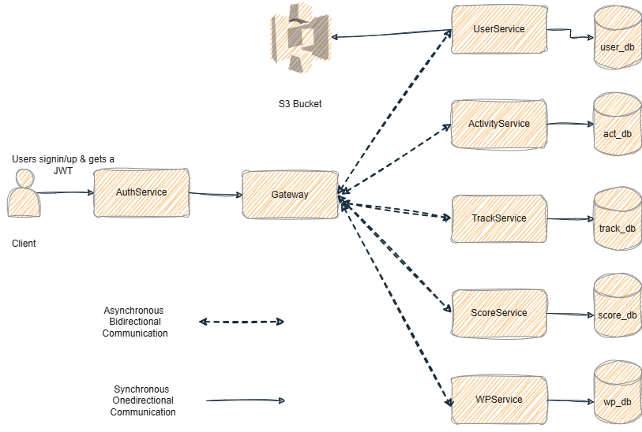

# Microservices Application Platform

A comprehensive Spring Boot microservices architecture designed for scalable, distributed application development with JWT-based authentication and inter-service communication.

## Overview

This project implements a microservices-based system using Spring Boot 3.x and Spring Cloud, featuring multiple independent services that communicate through REST APIs and OpenFeign clients. The architecture follows modern cloud-native patterns with a centralized API Gateway, authentication service, and domain-specific microservices for user management, activity tracking, scoring, and workout planning.

## Architecture

### Architecture Pattern: Microservices with API Gateway

The system follows a **microservices architecture** with the following key characteristics:

- **API Gateway Pattern**: Single entry point for all client requests, routing traffic to appropriate services
- **Service-to-Service Communication**: OpenFeign clients enable synchronous REST-based communication
- **JWT Authentication**: Stateless authentication mechanism for secure service access
- **Database per Service**: Each microservice maintains its own MySQL database for data isolation
- **Independent Deployment**: Services can be developed, deployed, and scaled independently

### Architecture Diagram



### Service Communication Flow

1. **Client Request** → API Gateway receives all incoming requests
2. **Authentication** → Gateway validates JWT tokens via AuthService
3. **Routing** → Gateway routes authenticated requests to appropriate microservices
4. **Inter-Service Communication** → Services communicate via OpenFeign clients when needed
5. **Response** → Gateway aggregates and returns responses to clients

### Key Architectural Benefits

- **Scalability**: Each service can be scaled independently based on load
- **Resilience**: Failure in one service doesn't bring down the entire system
- **Technology Flexibility**: Services can use different tech stacks if needed
- **Team Autonomy**: Different teams can own and develop separate services
- **Deployment Independence**: Services can be deployed without affecting others


## Data Flow

### Authentication Flow

```
1. User Registration/Login
   Client → Gateway → AuthService → UserService (verify/create user)
   AuthService generates JWT token
   Token returned to client

2. Authenticated Request
   Client (with JWT) → Gateway (validates token) → Target Service
   Service processes request and returns response
```

### Inter-Service Communication

Services communicate using **OpenFeign** declarative REST clients:

- **AuthService** → **UserService**: User verification and registration
- **ActivityService** → Other services: Activity data sharing
- **ScoreService** → Other services: Score calculations and metrics

### Data Persistence

Each service maintains its own MySQL database following the **Database per Service** pattern:
- Ensures loose coupling between services
- Allows independent schema evolution
- Prevents direct database access between services
- All data sharing happens through REST APIs

## Technology Stack

### Core Technologies
- **Java 21**: Modern Java LTS version
- **Spring Boot 3.2.x - 3.5.x**: Microservices framework
- **Spring Cloud 2023.x - 2025.x**: Cloud-native patterns
- **MySQL**: Relational database for each service
- **Maven**: Build and dependency management

### Key Dependencies
- **Spring Data JPA**: Database access and ORM
- **Spring Web**: REST API development
- **Spring Security**: Authentication and authorization
- **Spring Cloud Gateway MVC**: API Gateway implementation
- **OpenFeign**: Declarative REST client for inter-service communication
- **JWT (jjwt 0.11.5)**: Token-based authentication
- **Lombok**: Boilerplate code reduction

## File Structure

```
.
├── Gateway/                      # API Gateway Service
│   ├── src/
│   │   └── main/
│   │       ├── java/com/example/Gateway/
│   │       │   ├── controller/   # Gateway controllers
│   │       │   └── configuration/ # Security & routing config
│   │       └── resources/
│   │           └── application.properties
│   └── pom.xml
│
├── AuthService/                  # Authentication Service
│   ├── src/
│   │   └── main/
│   │       ├── java/com/example/AuthService/
│   │       │   ├── controllers/  # Auth endpoints
│   │       │   ├── jwtFiles/     # JWT utilities
│   │       │   ├── clients/      # Feign clients
│   │       │   ├── models/       # Request/Response models
│   │       │   ├── configuration/# Security config
│   │       │   ├── exception/    # Exception handlers
│   │       │   └── services/     # Business logic
│   │       └── resources/
│   └── pom.xml
│
├── UserService/                  # User Management Service
│   ├── src/
│   │   └── main/
│   │       ├── java/com/example/User/
│   │       │   ├── controllers/  # User CRUD endpoints
│   │       │   ├── entities/     # User entity
│   │       │   ├── repos/        # JPA repositories
│   │       │   ├── services/     # Business logic
│   │       │   ├── utils/        # Utility classes
│   │       │   ├── response/     # Response wrappers
│   │       │   └── exception/    # Exception handlers
│   │       └── resources/
│   └── pom.xml
│
├── ActivityService/              # Activity Tracking Service
│   ├── src/
│   │   └── main/
│   │       ├── java/com/example/ActivityService/
│   │       │   ├── controller/   # Activity endpoints
│   │       │   ├── entities/     # Activity entities
│   │       │   ├── repos/        # Repositories
│   │       │   └── services/     # Business logic
│   │       └── resources/
│   └── pom.xml
│
├── ScoreService/                 # Scoring Service
│   ├── src/
│   │   └── main/
│   │       ├── java/com/example/ScoreService/
│   │       │   ├── controller/   # Score endpoints
│   │       │   ├── entities/     # Score entities
│   │       │   ├── repos/        # Repositories
│   │       │   └── services/     # Scoring logic
│   │       └── resources/
│   └── pom.xml
│
├── TrackService/                 # Progress Tracking Service
│   ├── src/
│   │   └── main/
│   │       ├── java/com/example/TrackService/
│   │       │   ├── controller/   # Tracking endpoints
│   │       │   ├── entities/     # Track entities
│   │       │   ├── repos/        # Repositories
│   │       │   └── services/     # Tracking logic
│   │       └── resources/
│   └── pom.xml
│
├── WPService/                    # Workout Plan Service
│   ├── src/
│   │   └── main/
│   │       ├── java/com/example/WPService/
│   │       │   ├── controller/   # Workout plan endpoints
│   │       │   ├── entities/     # Plan entities
│   │       │   ├── repos/        # Repositories
│   │       │   └── services/     # Plan logic
│   │       └── resources/
│   └── pom.xml
│
├── server.drawio.png             # Architecture diagram
└── README.md                     # This file
```


## API Documentation

Comprehensive OpenAPI 3.0 documentation is available for all services in the `api-docs/` folder:

- **[Gateway API](api-docs/gateway-api.yaml)** - API Gateway routing and configuration
- **[Auth Service API](api-docs/auth-service-api.yaml)** - Authentication and JWT token management
- **[User Service API](api-docs/user-service-api.yaml)** - User management and profile operations
- **[Activity Service API](api-docs/activity-service-api.yaml)** - Activity session tracking (Running, Cycling, Walking)
- **[Score Service API](api-docs/score-service-api.yaml)** - Score calculation and metrics tracking

### Viewing API Documentation

You can view and interact with the API documentation using:

1. **Swagger UI**: Import the YAML files into [Swagger Editor](https://editor.swagger.io/)
2. **Postman**: Import the OpenAPI specs directly into Postman
3. **VS Code**: Use the OpenAPI (Swagger) Editor extension
4. **Redoc**: Generate beautiful API documentation with [Redoc](https://github.com/Redocly/redoc)

### Quick Start

All services follow a consistent response structure:

**Success Response:**
```json
{
  "success": true,
  "message": "Operation successful",
  "data": { /* response data */ }
}
```

**Error Response:**
```json
{
  "success": false,
  "message": "Error description",
  "error": "Detailed error message"
}
```

### Authentication

Most endpoints require JWT authentication. Include the token in the request header:
```
Authorization: Bearer <JWT_TOKEN>
```

Public endpoints (no authentication required):
- `/public/auth/login`
- `/public/auth/register`
- `/public/auth/test`

## Getting Started

### Prerequisites
- Java 21 or higher
- Maven 3.6+
- MySQL 8.0+
- IDE (IntelliJ IDEA, Eclipse, or VS Code)

### Database Setup

Create separate MySQL databases for each service:
```sql
CREATE DATABASE gateway_db;
CREATE DATABASE auth_db;
CREATE DATABASE user_db;
CREATE DATABASE activity_db;
CREATE DATABASE score_db;
CREATE DATABASE track_db;
CREATE DATABASE wp_db;
```

### Configuration

Update `application.properties` in each service's `src/main/resources/` directory:

```properties
# Database Configuration
spring.datasource.url=jdbc:mysql://localhost:3306/<service_db>
spring.datasource.username=your_username
spring.datasource.password=your_password

# JPA Configuration
spring.jpa.hibernate.ddl-auto=update
spring.jpa.show-sql=true

# Server Port (different for each service)
server.port=<service_port>
```

### Running the Services

1. **Start each service individually:**

```bash
# Gateway (start first)
cd Gateway
mvnw spring-boot:run

# AuthService
cd AuthService
mvnw spring-boot:run

# UserService
cd UserService
mvnw spring-boot:run

# ActivityService
cd ActivityService
mvnw spring-boot:run

# ScoreService
cd ScoreService
mvnw spring-boot:run

# TrackService
cd TrackService
mvnw spring-boot:run

# WPService
cd WPService
mvnw spring-boot:run
```

2. **Recommended Port Configuration:**
- Gateway: 8080
- AuthService: 8081
- UserService: 8082
- ActivityService: 8083
- ScoreService: 8084
- TrackService: 8085
- WPService: 8086

### Testing the Setup

1. Register a new user:
```bash
curl -X POST http://localhost:8080/public/auth/register \
  -H "Content-Type: application/json" \
  -d '{"username":"testuser","email":"test@example.com","password":"password123"}'
```

2. Login and get JWT token:
```bash
curl -X POST http://localhost:8080/public/auth/login \
  -H "Content-Type: application/json" \
  -d '{"email":"test@example.com","password":"password123"}'
```

3. Use the token for authenticated requests:
```bash
curl -X GET http://localhost:8080/api/users/username/testuser \
  -H "Authorization: Bearer <your_jwt_token>"
```

## Development

### Building the Project

```bash
# Build all services
mvn clean install

# Build specific service
cd <ServiceName>
mvn clean package
```

### Running Tests

```bash
# Run tests for all services
mvn test

# Run tests for specific service
cd <ServiceName>
mvn test
```

## Contributing

1. Fork the repository
2. Create a feature branch (`git checkout -b feature/amazing-feature`)
3. Commit your changes (`git commit -m 'Add amazing feature'`)
4. Push to the branch (`git push origin feature/amazing-feature`)
5. Open a Pull Request

## License

This project is a demo application for educational purposes.

## Contact

For questions or support, please open an issue in the repository.
